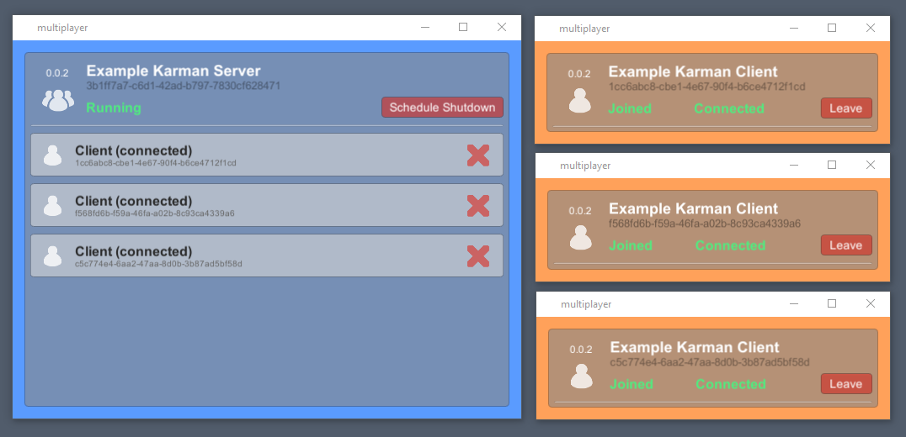

# Multiplayer

This project serves as a reference implementation of a multiplayer game in the Unity3D game engine. It is written by Simon Karman.

## Reference articles

- [Sockets in C#](https://docs.microsoft.com/en-us/dotnet/framework/network-programming/sockets) in Microsoft Documentation
- [Message Framing](https://blog.stephencleary.com/2009/04/message-framing.html) by Stephen Cleary
- [Length Prefixed Message Framing](https://blog.stephencleary.com/2009/04/sample-code-length-prefix-message.html) by Stephen Cleary
